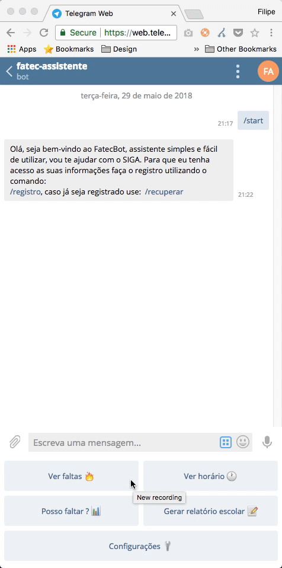
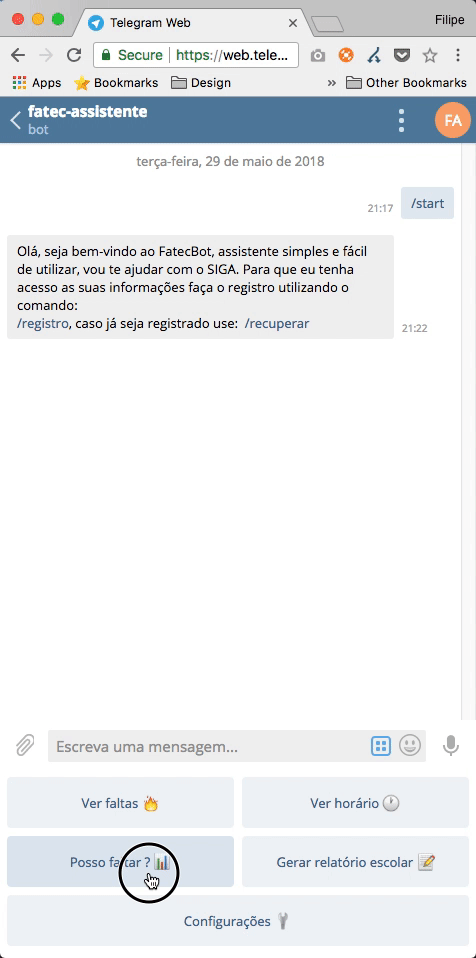
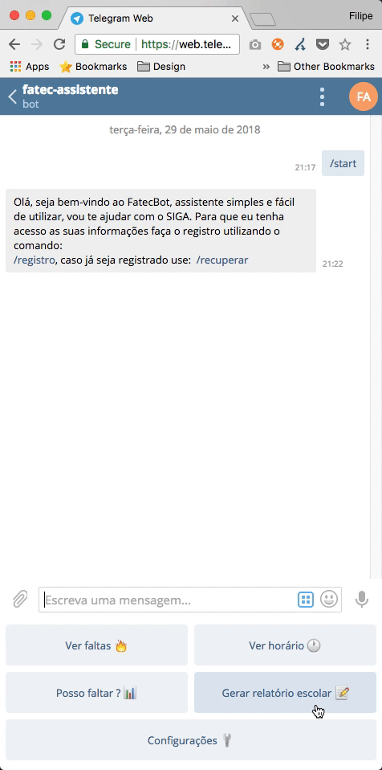
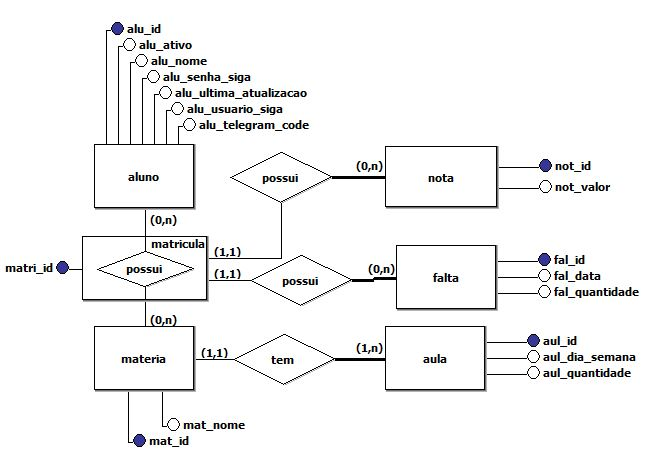
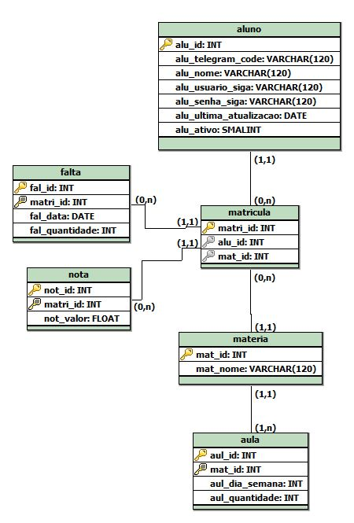

# FatecBot - Telegram

[](https://www.codacy.com/app/M3nin0/FatecBot?utm_source=github.com&amp;utm_medium=referral&amp;utm_content=IHCF/FatecBot&amp;utm_campaign=Badge_Grade)
[](https://opensource.org/licenses/BSD-2-Clause)

CUI para Telegram que facilita o acesso aos dados do SIGA

## Sobre :speech_balloon:

Acessar o SIGA nem sempre é uma tarefa fácil, dentro de um ônibus, ou andando, por exemplo, pode-se ter problemas, mas uma conversa rápida ? É bem mais fácil, por isso criamos o FatecBot, que facilita o processo de aquisições de dados do SIGA, e devolve tudo em uma interface simples.

Há outros projetos que tem a mesma finalidade, que também foram criados por nós.

- [Fatec API](https://github.com/filipemeneses/fatec-api) :rage1:
- [Fatec Bot para Discord](https://github.com/M3nin0/fatec-bot) :rage2:
- [Fatec Posso Faltar](https://github.com/filipemeneses/fatec-posso-faltar) :rage3:
- [Fatec Posso Faltar Bot](https://github.com/IHCF/posso-faltar-bot) :rage4:

Todos esses projetos auxiliam os alunos a ter acesso aos dados do SIGA. Este projeto foi feito como parte da matéria de Engenharia de software 3 :sunglasses:

## Demonstração de uso :arrow_forward:

```Iniciando conversa```


``` Realizando cadastro ```


``` Recuperando cadastro (Caso já tenha utilizado o bot antes) ```


``` Botões para interação com o bot ```


``` Verificando faltas ```



``` Verificando horários de aula ```


``` Posso faltar? ```



``` Histórico escolar ```



Ao clicar em `Histórico escolar`, o chatbot gera um [PDF do histórico escolar](imagens_bot/historico-escolar.pdf).

> Esse histórico escolar é gerado pelo bot, não é ferramenta oficial do SIGA da Centro Paula Souza.

## Diagramas do sistema :clipboard:

``` Bot ```


``` Banco de dados ```

Este bot pode trabalhar utilizando dois SGBDs diferentes:
* Database 4 Object;
* PostgreSQL.

Abaixo os modelos conceituais e lógico do banco

* Conceitual



* Lógico




OBS: É importante lembrar que, esta estrutura é valida somente para o PostgreSQL, no caso do Database 4 Object trabalha-se diretamente com os objetos.

Para realizar a troca de banco de dados é necessário definir o `ID do admin` no arquivo `telegram.properties
`. Ao fazer isto o usuário que receber este privilégio, terá disponível os comandos:

* <code>/change_databases_pg</code> - Troca o banco para PostgreSQL;
* <code>/change_databases_dbo</code> - Troca o banco para Database4Object.

Veja que o banco padrão da aplicação é o Database4Object.
